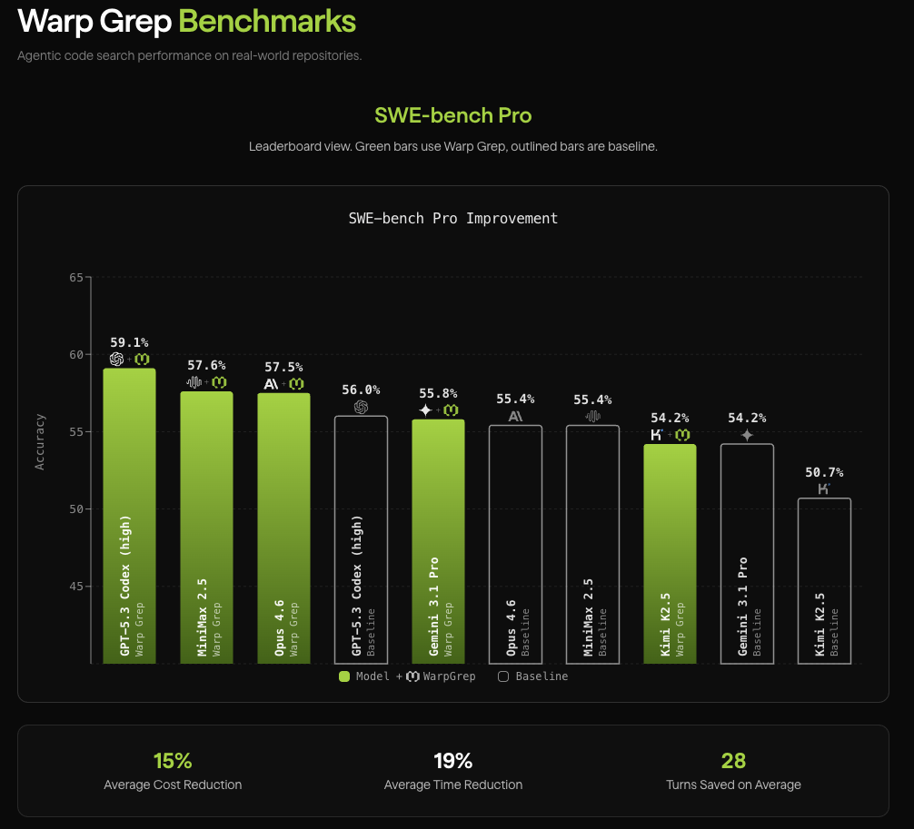

# opencode-morph-plugin

Source repository: https://github.com/morphllm/opencode-morph-plugin

[OpenCode](https://opencode.ai) plugin for [Morph](https://morphllm.com). Four tools:

- **Fast Apply** — 10,500+ tok/s code editing with lazy markers
- **WarpGrep** — fast agentic codebase search, +4% on SWE-Bench Pro, -15% cost
- **Public Repo Context** — grounded context search for public GitHub repos without cloning
- **Compaction** — 25,000+ tok/s context compression in sub-2s, +0.6% on SWE-Bench Pro



On production repos and SWE-Bench Pro, enabling WarpGrep and compaction improves task accuracy by **6%**, reduces cost, and is net **28% faster**.

---

## Quick Start

### 1. Get a Morph API key

Sign up at [morphllm.com/dashboard](https://morphllm.com/dashboard/api-keys).

For terminal usage, export it:

```bash
export MORPH_API_KEY="sk-..."
```

Add this to your shell profile (`~/.zshrc`, `~/.bashrc`, etc.) so it persists.

### 2. Install the plugin

```bash
cd ~/.config/opencode
bun i @morphllm/opencode-morph-plugin
```

### 3. Register in opencode.json

Edit `~/.config/opencode/opencode.json`:

```json
{
  "$schema": "https://opencode.ai/config.json",
  "plugin": ["@morphllm/opencode-morph-plugin"],
  "instructions": [
    "node_modules/@morphllm/opencode-morph-plugin/instructions/morph-tools.md"
  ]
}
```

For OpenCode desktop or other environments where shell environment variables
are inconvenient, configure the API key as a plugin option in your global
OpenCode config:

```json
{
  "$schema": "https://opencode.ai/config.json",
  "plugin": [
    [
      "@morphllm/opencode-morph-plugin",
      {
        "apiKey": "{file:~/.secrets/morph-api-key}"
      }
    ]
  ],
  "instructions": [
    "node_modules/@morphllm/opencode-morph-plugin/instructions/morph-tools.md"
  ]
}
```

You can also set `"apiKey": "sk-..."` directly, but prefer global config or
`{file:...}` for secrets. Do not commit API keys in project config.

### 4. Start OpenCode

```bash
opencode
```

You should see `morph_edit`, `warpgrep_codebase_search`, and `warpgrep_github_search` in the available tools. Compaction runs automatically in the background.

---

## Compaction

Context compression via the Morph Compact API. Runs automatically before each LLM call when the conversation exceeds a token threshold.

### How it works

1. Before each LLM call, the plugin estimates the total characters in the conversation
2. If the estimate exceeds the threshold, older messages are compressed via the Morph Compact API (~250ms)
3. The compressed result is cached ("frozen") and reused on subsequent calls for prompt cache stability
4. Only the most recent user message is kept uncompacted

The LLM receives compressed history + your latest prompt. The "Context: X tokens" number in the sidebar reflects the actual tokens sent (post-compaction).

### Configuring the compaction threshold

By default, compaction triggers at **70% of the model's context window**. You can override this with a fixed token limit:

```bash
# Compact when conversation exceeds 20,000 tokens
export MORPH_COMPACT_TOKEN_LIMIT=20000
```

For aggressive compaction during testing:

```bash
export MORPH_COMPACT_TOKEN_LIMIT=5000
```

### Verifying compaction is working

Check the OpenCode log files in `~/.local/share/opencode/log/`. Look for entries with `service=morph`:

```bash
grep "service=morph" ~/.local/share/opencode/log/*.log | grep -i compact
```

When compaction fires, you'll see entries like:

```
INFO service=morph First compaction: 2 messages (30137 chars), keeping 1 recent. Threshold crossed: 30178 >= 15000
INFO service=morph Compact: 2 messages -> 2 frozen (15142 chars). Messages: 3 -> 3. Ratio: 45% kept (244ms)
```

You'll also see a toast notification in the OpenCode UI when compaction triggers.

On subsequent LLM calls (before re-compaction is needed), you'll see:

```
INFO service=morph Under threshold - reusing frozen block. Messages: 5 -> 5
```

---

## Tools

### Fast Apply (`morph_edit`)

10,500+ tok/s code merging. The LLM writes partial snippets with lazy markers (`// ... existing code ...`), Morph merges them into the full file.

Best for large files (300+ lines) and multiple scattered changes. For small exact replacements, use OpenCode's built-in `edit` tool.

### WarpGrep (`warpgrep_codebase_search`)

Fast agentic codebase search. Runs multi-turn ripgrep + file reads to find relevant code contexts. Sub-6s per query. Best for exploratory queries ("how does X work?", "where is Y handled?").

### Public Repo Context (`warpgrep_github_search`)

Search public GitHub repositories without cloning. Pass an `owner/repo` or GitHub URL and a search query. Returns relevant file contexts from Morph's indexed public repo search.

---

## Configuration

Credentials can be configured with the plugin `apiKey` option or the
`MORPH_API_KEY` environment variable. The plugin option is checked first; if it
is missing or blank, `MORPH_API_KEY` is used.

| Setting | Default | Description |
|---------|---------|-------------|
| Plugin option `"apiKey"` | falls back to `MORPH_API_KEY` | Your Morph API key in the OpenCode `plugin` config entry |
| `MORPH_API_KEY` | *required unless `apiKey` is set* | Your Morph API key |
| `MORPH_COMPACT_TOKEN_LIMIT` | auto (70% of model window) | Fixed token threshold for compaction |
| `MORPH_COMPACT_CONTEXT_THRESHOLD` | `0.7` | Fraction of model context window to trigger compaction (used when `TOKEN_LIMIT` is not set) |
| `MORPH_COMPACT_PRESERVE_RECENT` | `1` | Number of recent messages to keep uncompacted |
| `MORPH_COMPACT_RATIO` | `0.3` | Target compression ratio (0.05-1.0, lower = more aggressive) |
| `MORPH_COMPACT` | `true` | Set `false` to disable compaction |
| `MORPH_EDIT` | `true` | Set `false` to disable Fast Apply |
| `MORPH_WARPGREP` | `true` | Set `false` to disable WarpGrep |
| `MORPH_WARPGREP_GITHUB` | `true` | Set `false` to disable public repo search |

---

## Development

```bash
bun install
bun test
bun run build
bun run typecheck
```

To test locally with OpenCode, symlink the plugin:

```bash
rm -rf ~/.config/opencode/node_modules/@morphllm/opencode-morph-plugin
ln -s /path/to/this/repo ~/.config/opencode/node_modules/@morphllm/opencode-morph-plugin
bun run build  # rebuild after changes
```

## License

[MIT](LICENSE)
